# Dark Water write up

**Welcome to Dark Waters, a scenario that allows you to take on the role of Investigative Journalist Alec Wolfe as he uncovers deadly secrets about a small town in Pennsylvania.**

Through Alec, you will experience first-hand what it's like to collect, analyze, and verify a breaking news piece for a newspaper. This scenario is designed to challenge and encourage you throughout the story to implement Open Source Intelligence and digital investigation techniques including:

1. Social media analysis
2. Visually extracting key data points from an image or video
3. Applying tools, methods, and resources to answer contextual questions to uncover the truth.

When you have completed this scenario you should be comfortable applying tools and methodologies frequently used in digital investigations including journalism. You learn to pivot from key data points and collect information used to answer investigative questions.

---
## Strange Letter
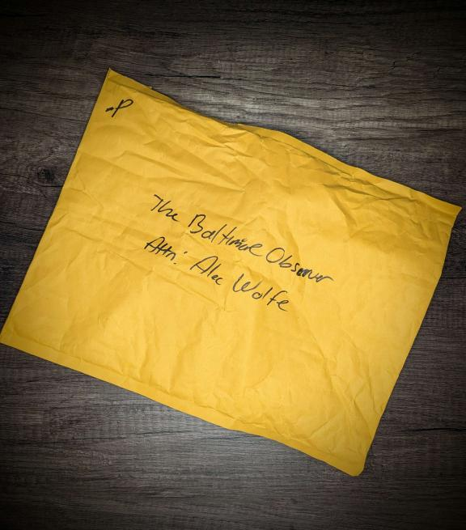
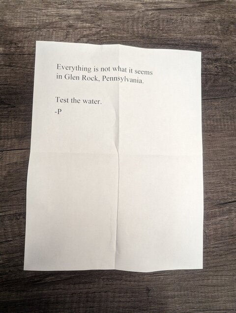

We are starting with 2 pictures addressed to our journalist Alec Wolfe from "P", an unknown sender.
We have a few information already:
- We know where to investigate, Glen Rock PA
- There is something going on with the water

---

## Welcome to Glen Rock, PA!
In this section, we have a video showing Alec driving to the bar of Glen Rock. 

---

## At The Bar
Arriving at the bar, Alec meet Lisa the barman and rent a room in her bar for his stay.

---

## The Protestor
Outside of the bar, Alec notices a young woman on the sitting in the sidewalk with a cardboard sign.
While talking to her, we can get some information about the town:
- Her family had been in the town for a while
- Her mother's great-grandfather bought the land of Glen Rock in 1837
- Her mother's great-gradfather refused to give the land to the GRPC plant

---

## GRPC: The Company That Cares About Nature
This section is showing a promotional video for GRPC and how they protect and care about the nature of the town.
Additionnaly we have their website [GRPC](https://www.kaseportal.com/grpc). 

---

## Getting to know the town

**Q1 What is the name of the protestor's relative that was the first to own land on what is now Glen Rock?**

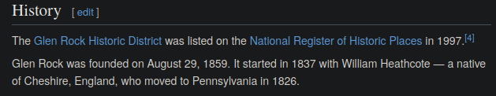

For this question, I could find the anwser by looking at the history of Glen Rock on [Wikipedia](https://en.wikipedia.org/wiki/Glen_Rock,_Pennsylvania).

> 🚩Flag: *William Heathcote*

**Q2 What is the name of the main Railroad through town?**

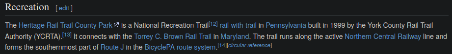

I used the same [Wikipedia](https://en.wikipedia.org/wiki/Glen_Rock,_Pennsylvania) page to find the anwser. If I try to search an element on the page by typing "Rail", I found the flag.

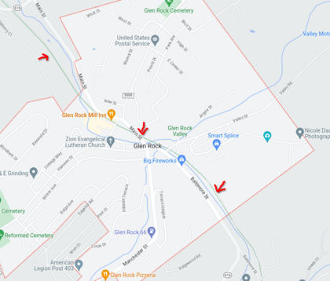

To confirm my finding, I can use google maps to make sure this is the correct railroad.

> 🚩Flag: *Northern Central Railway*

**Q3 On the side of the local library, what does the third part of the mural say?**

I could find the local library by searching on Google maps.

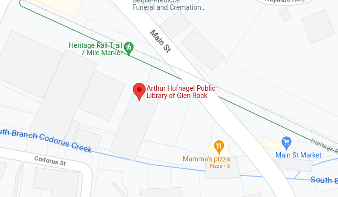

I found the "[Arthur Hufnagel Public Library of Glen Rock](https://goo.gl/maps/m69N9PPFZXpNoNDz7?coh=178572&entry=tt)", but after trying with Street View I couldn't get a closer look on the mural painting.

After looking in the pictures posted in the library reviews, I found a picture in front of the mural I could use.

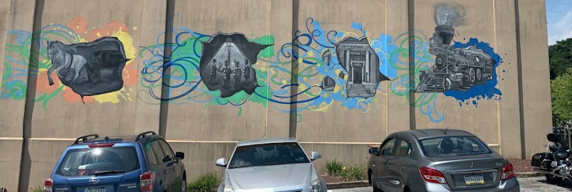
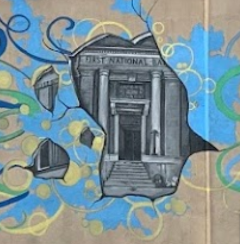

I could read the writing of the mural using this picture. After trying the flag "FIRST NATIONAL BANK", it doesn't work so I though that might be a typo or a case sensitive flag.

> 🚩Flag: *First National Bank*
  
**Q4 Which female artist donated her pastel work "under the rainbow" to the library?**

I was stuck on this one because I couldn't find the pastel work. But after using Google dorking, I found a [newspaper](https://issuu.com/engleprintingandpublishing/docs/ccs_102319) talking about a library diplaying artwork. After reading the article, I was able to get the flag.

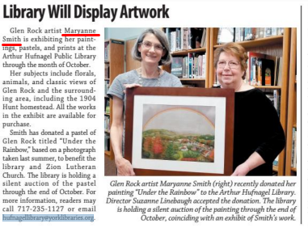

> 🚩Flag: *Maryanne Smith*

**Q5 What is the street name of Maryanne’s studio?**

A good Google search can flag this one. After searching for "Maryanne Smith studio glen rock", I get a [Linkedin](https://www.linkedin.com/in/maryanne-smith-0a6bb757) profile and a website selling [art](https://auctions.slamquest.org/SLA-55-Altay-Argali-Painting-by-Maryanne-Smith_i35406483) for auction.

Maryanne studio location can be found in the item description.

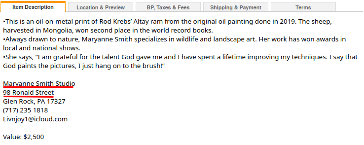

> 🚩Flag: *Ronald Street*

**Q6 Where was this taken in town?**

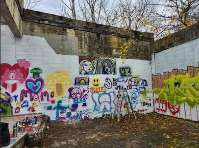

I could find the place by reversing it on Google image, it was linked to a [Facebook](https://www.facebook.com/RuinsHall/)

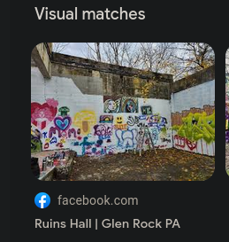

> 🚩Flag: *Ruins Hall*

**Q7 The protester was attending an event there on June 8th 2018 what was it?**

This one was a little bit complicated for me because I was looking for any post or article at this date.

But after trying to search on the ruins hall Facebook page with a filter on the date, I still couldn't get anything.

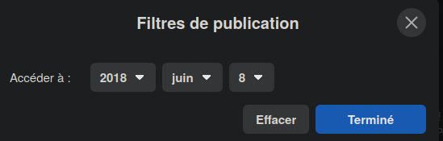

I got a result after searching for "June" in the result of the filter.
From here, I found the flag in the post description.

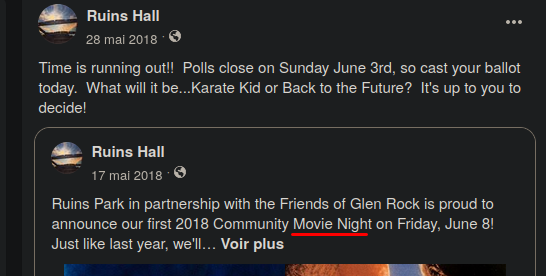

> 🚩Flag: *Movie Night*

**Q8 Which movie was shown at the event?**

The answer of the question was also in the post but under it was a poll where we could choose for the movie.

The flag here is the most voted movie.

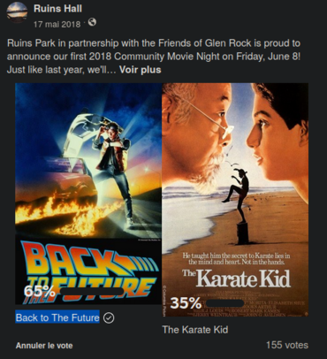

> 🚩Flag: *Back To The Future*

**Q9 What was the high temp on that day in Celsius(Only one decimal point is needed)?**

A quick search on Google and a website that archive the weather data helped me to find the flag.

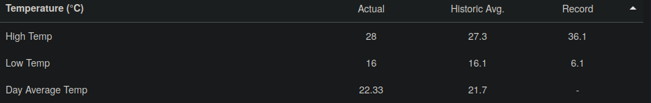

> 🚩Flag: *28*

---

## Cocktail Party

We have a flyer in this section inviting us to a cocktail party organized by the GRPC.

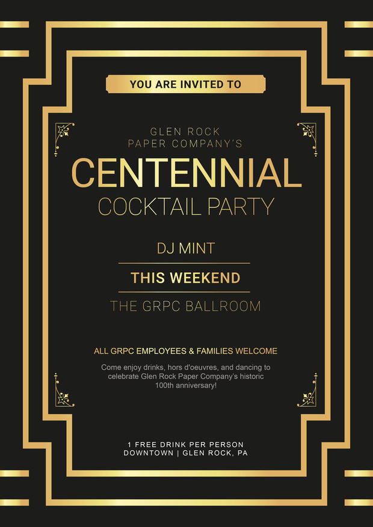

---

## Party Recon

We find some important personnality of the town at the party, like the the local politician and the CEO's son of GRPC.

---

## Eavesdrop

We overhear a conversation between 2 guards in front of the line for the party. They are talking about some kind of drop and side hustle to make money on the side. 

Sadly they don't allow us to go in because we are not on the list.

---

## Text To George Hammond

We are texting our boss, George Hammond, because we couldn't get inside the party, it was too crowded.

## The Employees

**Q10 Who created this flyer?**

For this flag, I used the metadata of the flyer we got from earlier and from the author of the file, I got the flag.

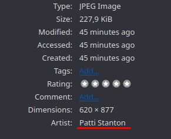

> 🚩Flag: *Patti Stanton*

**Q11 What is Patti's favorite thing to do?**

There is only one place where we can see any information about her: the company website we saw earlier.

https://www.kaseportal.com/grpc

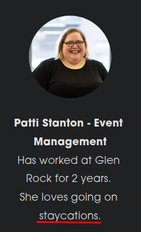

> 🚩Flag: *Staycations*

**Q12 What is Patti's home SSID?**

For this question, I didn't even know that OSINT on SSID or WiFi was possible so look it up on Google for the first time. And I found a website showing how to do OSINT on SSID using the website : https://wigle.net .

But even with the tools to find the flag, I couldn't find where to start with only a few information:
- her name "Patti Stanton"
- where she works "GRPC" and her job here "Event Management"
- where she lives maybe "Glen Rock"?
- she loves "staycation"

Just to make sure she wasn't a real person, I checked on Google in case I find something else but nothing here. Since the website with the Wifi map have a search tool integrated, I used the information we had on her supposing she modified her SSID to her name or something easy to remember.
The search tool also had the possibility to search with wildcards "%" so it might be easier to the SSID that way.

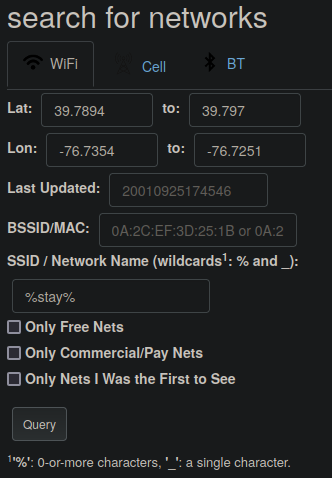

Based on that supposition, I started with her name  and the location "Glen Rock" with wildcards around it, found nothing for it.

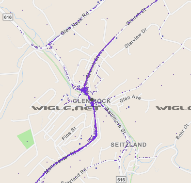

Staying in Glen Rock, I searched for a company building or address if I could find an address but nothing here too.

But after looking for "staycation", it finds 1 Wifi router in Glen Rock.

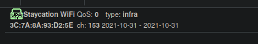

> 🚩Flag: *staycation Wifi*

**Q13 What is the BSSID?**

After finding her SSID, I find that the website store a few information about that router.

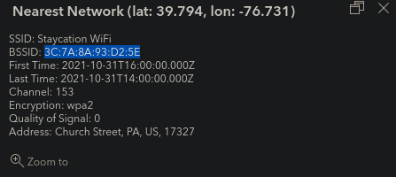

> 🚩Flag: *3C:7A:8A:93:D2:5E*

**Q14 What year was this BSSID first seen?**

> 🚩Flag: *2021*

**Q15 What is the vendor of this device?**

For this question, I know that every device has its vendor name if we search on MAC address database.

https://mac.lc/address/3C-7A-8A

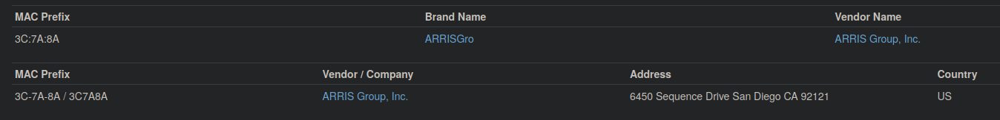

> 🚩Flag: *ARRIS Group*

**Q16 What is the parent company of Arris Group Inc?**

This question was a bit trickier than I thought because if we just put the parent company written on wikipedia, it doesn't work.

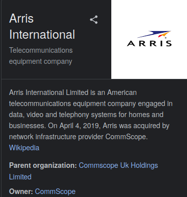

But if we just look at the parent company before the current one bought it, we have another parent company.

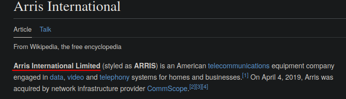

> 🚩Flag: *Arris International Limited*

---

## Campaign funding

**Q17 How much money has GRPC donated to Alexander Ross?**

This question take us back to the beginning where they give us the company website. Next to the the cocktail party flyer, we can see a few information about the company news.

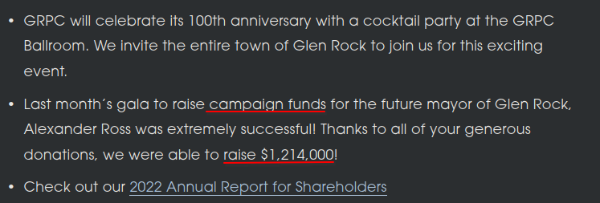

After reading them, we find the information about Alexander Ross campaign.

> 🚩Flag: *1,214,000*

**Q18 What is the GRPC campaign phone number for Alexander Ross?**

When we had the website at the beginning, I already read everything on it to make sure I wasn't missing something. So the phone number was at the bottom of the page associated with Alexander Ross name.

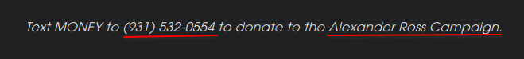

> 🚩Flag: *(931) 532-0554*

**Q19 How much did Glen Rock Paper Company spend on PR services in 2022?**

First, I thought that PR meant "press release" but after looking at the annual report for shareholders, I couldn't find anything that matches.

I ended up reading the whole report and found Public Relations Fees.

> 🚩Flag: *11,576*

---

## Taking a water sample

We are taking a water sample from river and we are sending it to make test on it.

## The locals

Going back to the bar, we have a confrontation with the locals because we are not from the town and they are suspicions about us.

## Who is P?

