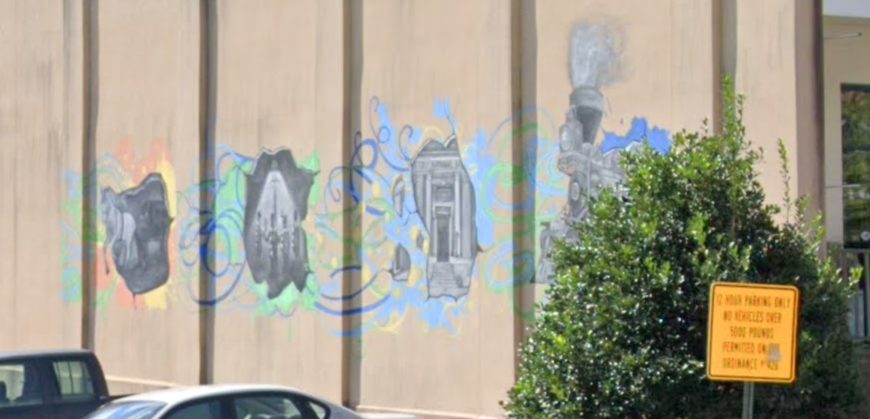

# Dark Water write up

**Welcome to Dark Waters, a scenario that allows you to take on the role of Investigative Journalist Alec Wolfe as he uncovers deadly secrets about a small town in Pennsylvania.**

Through Alec, you will experience first-hand what it's like to collect, analyze, and verify a breaking news piece for a newspaper. This scenario is designed to challenge and encourage you throughout the story to implement Open Source Intelligence and digital investigation techniques including:

1. Social media analysis
2. Visually extracting key data points from an image or video
3. Applying tools, methods, and resources to answer contextual questions to uncover the truth.

When you have completed this scenario you should be comfortable applying tools and methodologies frequently used in digital investigations including journalism. You learn to pivot from key data points and collect information used to answer investigative questions.

---
## Strange Letter

We are starting with 2 pictures addressed to our journalist Alec Wolfe from "P", an unknown sender.
We have a few information already:
- We know where to investigate, Glen Rock PA
- There is something going on with the water

---

## Welcome to Glen Rock, PA!
In this section, we have a video showing Alec driving to the bar of Glen Rock. 

---

## At The Bar
Arriving at the bar, Alec meet Lisa the barman and rent a room in her bar for his stay.

---

## The Protestor
Outside of the bar, Alec notices a young woman on the sitting in the sidewalk with a cardboard sign.
While talking to her, we can get some information about the town:
- Her family had been in the town for a while
- Her mother's great-grandfather bought the land of Glen Rock in 1837
- Her mother's great-gradfather refused to give the land to the GRPC plant

---

## GRPC: The Company That Cares About Nature
This section is showing a promotional video for GRPC and how they protect and care about the nature of the town.
Additionnaly we have their website [GRPC](https://www.kaseportal.com/grpc). 

---

## Getting to know the town

**Q1 What is the name of the protestor's relative that was the first to own land on what is now Glen Rock?**

For this question, I could find the anwser by looking at the history of Glen Rock on [Wikipedia](https://en.wikipedia.org/wiki/Glen_Rock,_Pennsylvania).

> 🚩Flag: *William Heathcote*

**Q2 What is the name of the main Railroad through town?**

I used the same [Wikipedia](https://en.wikipedia.org/wiki/Glen_Rock,_Pennsylvania) page to find the anwser. If I try to search an element on the page by typing "Rail", I found the flag.

To confirm my finding, I can use google maps to make sure this is the correct railroad.

> 🚩Flag: *Northern Central Railway*

**Q3 On the side of the local library, what does the third part of the mural say?**

I could find the local library by searching on Google maps.

I found the "[Arthur Hufnagel Public Library of Glen Rock](https://goo.gl/maps/m69N9PPFZXpNoNDz7?coh=178572&entry=tt)", but after trying with Street View I couldn't get a closer look on the mural painting.

After looking in the pictures posted in the library reviews, I found a picture in front of the mural I could use.

I could read the writing of the mural using this picture. After trying the flag "FIRST NATIONAL BANK", it doesn't work so I though that might be a typo or a case sensitive flag.

> 🚩Flag: *First National Bank*
  
**Q4 Which female artist donated her pastel work "under the rainbow" to the library?**

I was stuck on this one because I couldn't find the pastel work. But after using Google dorking, I found a [newspaper](https://issuu.com/engleprintingandpublishing/docs/ccs_102319) talking about a library diplaying artwork. After reading the article, I was able to get the flag.

> 🚩Flag: *Maryanne Smith*
